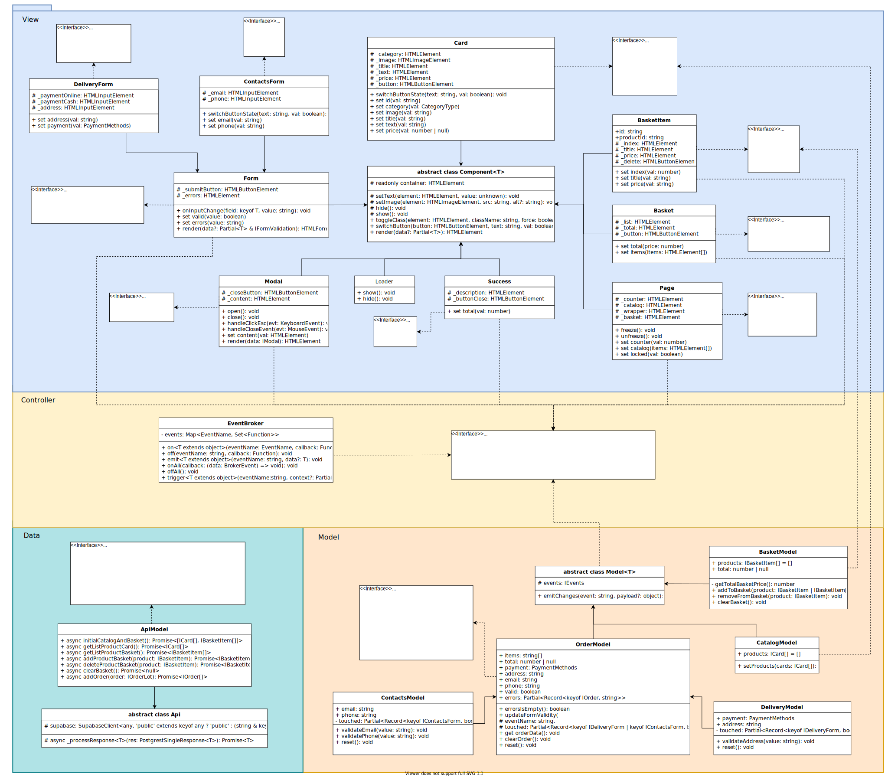

# SnapShop

SnapShop — представляет собой интернет-магазин в стиле пиксель-арт с элементами неонового дизайна, с использованием технологий, таких как TypeScript, SCSS и Webpack.
- Спроектирована MVC архитектура с принципами ООП.
- Проект интегрирован с API сторонней базы данных [Supabase](https://supabase.com).

---

## Функциональность

- Просмотр полной карточки товара
- Добавление товары в корзину.
- Удаление товары из корзины.
- Оформление заказа, введя контактные данные и информацию о доставке.

## Стек

- `SCSS`
- `TS`
- `Webpack`

## Webpack

Для удобства поддержки и масштабирования конфигурации, сборка Webpack была модульно организована.
Все настройки вынесены в отдельные файлы в папке `build`, а основной файл конфигурации просто подключает и объединяет эти модули.
В папке build находятся следующие модули:
- `buildDevServer`
  Содержит настройки для локального dev-сервера.
- `buildLoaders`
  Отвечает за настройку загрузчиков.
- `buildPlugins`
  Содержит конфигурации для всех используемых плагинов.
- `buildResolvers`
  Отвечает за настройки разрешения модулей.

## Архитектура

Проектируя в соответствии с архитектурой MVC, были реализованы 3 слоя:

- `Model` - слой, отвечающий за данные и логику
- `View` - слой представления, отвечает за отображение данных пользователю
- `Controller` - слой управления, отвечает за взаимодействие между Model и View


- В папке `Components/View` - классы представления
- В папке `Components/Model` - классы модели соответственно
- В папке `Components/Base` - базовый переиспользуемый код, который может относиться к любому слою, там же находится класс **EventBroker**, относящийся к контроллеру.

---

## Структурная UML-диаграмма


---

## Установка и запуск

Для установки и запуска проекта необходимо выполнить команды

```
npm install
npm run start
```

или

```
yarn
yarn start
```

## Сборка

```
npm run build
```

или

```
yarn build
```

---

## API

Для взаимодействия с внешним API используется [Supabase](https://supabase.com).
Через его REST-интерфейс осуществляется работа с товарами, корзиной и заказами, без необходимости поднимать собственный сервер.


## Структура проекта

- `src/` — исходные файлы проекта
- `src/components/` — папка с JS компонентами
- `src/components/base/` — папка с базовым кодом

### Базовые компоненты

`Api` - это базовый класс для работы с API.


`EventBroker` - класс имплементирует интерфейс `IEvents` и представляет собой брокер событий, выполняющего роль контроллера, обеспечивающего связь между моделью и отображением.

`Component` - абстрактный класс базового отображения. Обеспечивает базовый функционал работы с DOM-элементами.

`Model` - абстрактный класс базовой модели.

### Модели данных

#### Класс `ApiModel`

Хранит все функции для взиамодействия с API

#### Класс `BasketModel`

Хранит данные о товарах, добавленных в корзину пользователем: список товаров и суммарную стоимость.

#### Класс `CatalogModel`

Хранит данные о всех товарах.

#### Класс `OrderModel`
Хранит все данные о заказе: массив id товаров из корзины, сумму заказа, данные о доставке контактных данных пользователя, взятые из полей ввода.
Является производным для классов валидации форм: `ContactsModel` и `DeliveryModel`.

#### Класс `ContactsModel`

Валидирует форму контактных данных пользователя, наследуется от `OrderModel`

#### Класс `DeliveryModel`

Валидирует форму с данными о методе оплаты и адресе доставки, наследуется от `OrderModel`

### Отображение

#### Класс `Page`

Используется для отображения всей главной страницы.

#### Класс `Card`

Класс отображения карточки товара. Используется для отображения карточки в каталоге и в модальном окне.

#### Класс `Modal`

Класс отображения модального окна. В нем будут рендериться компоненты.

#### Класс `Basket`

Это класс отображения корзины. Так как корзина открывается в отдельном модельном окне, она будет рендерится через модалку. Через сеттер `items` будут добавляться выбранные товары в список.

#### Класс `BasketItem`

Нужен для отображения товара из списка в корзине. Добавляется в корзину через сеттер класса `Basket` `items`.

#### Класс `Form`

Используется отображения формы.
Для оформления заказа нужно заполнить две формы: форма с методом оплаты и деталями для оформления доставки и форма с контактными данными пользователя.

#### Класс `DeliveryForm`

Для отображения формы с данными о доставке: адрес и способ оплаты.

#### Класс `ContactsForm`

Для отображения формы о контактах пользователя: почта и телефон.

#### Класс `Success`

Класс отображения окна с уведомлением об успешной оплате и оформлении заказа.

#### Класс `Loader`

Класс для отображения лоадера, который показывается при открытии и загрузке страницы.


### Контроллер

Модели данных и отображения связаны при помощи брокера событий - класса `EventBroker`.

Можно подписаться на событие, для этого в метод `on` передать имя события и коллбэк, который выполняется при каждом вызове этого события, затем событие вызывается с помощью метода `emit`, в него можно передать аргументы, которые будут переданы во все функци, которые подписаны на это событие.

`EventBroker` позволяет передавать в модель данные, полученные из отображения, а так же менять отображение при изменении данных в модели.

